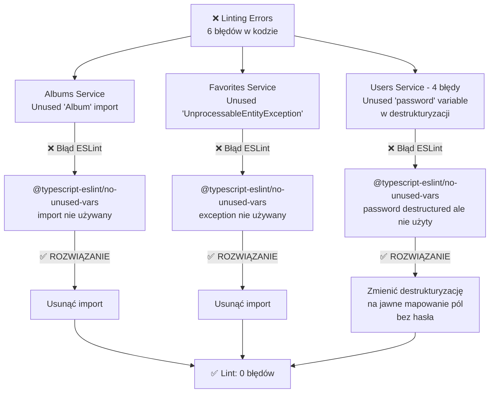
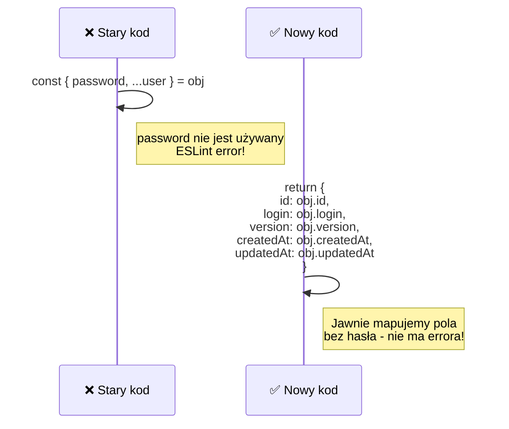

# Problem 1: Linting Errors

## Diagram - Nieużywane zmienne

## Szczegóły Poprawy - Users Service

## Rezultat

| Plik | Błędy Przed | Błędy Po | Status |
|------|-------------|----------|--------|
| albums.service.ts | 1 | 0 | ✅ |
| favorites.service.ts | 1 | 0 | ✅ |
| users.service.ts | 4 | 0 | ✅ |
| **RAZEM** | **6** | **0** | **✅ FIXED** |
