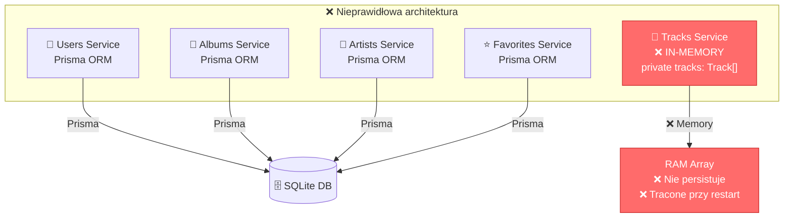
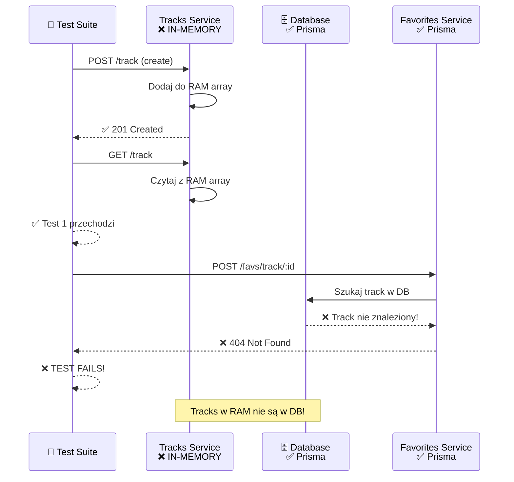
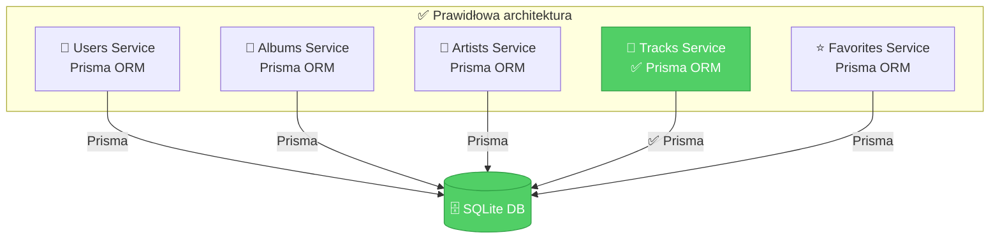
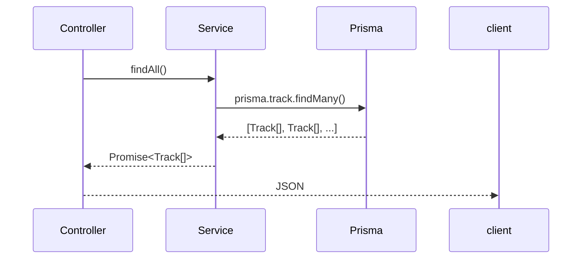

# Problem 2: Tracks Service - In-Memory vs Prisma

## Architektura Przed Poprawą



## Problem w Testach



## Rozwiązanie - Migracja na Prisma



## Implementacja Poprawki

### Krok 1: TracksModule Import Prisma

```typescript
// ❌ PRZED
@Module({
  controllers: [TracksController],
  providers: [TracksService],
})

// ✅ PO
@Module({
  imports: [PrismaModule],
  controllers: [TracksController],
  providers: [TracksService],
})
```

### Krok 2: TracksService - Zmiana na Async + Prisma



## Porównanie Metod

| Operacja | IN-MEMORY ❌ | PRISMA ✅ |
|----------|-------------|----------|
| `create()` | `this.tracks.push()` | `prisma.track.create()` |
| `findAll()` | `return this.tracks` | `prisma.track.findMany()` |
| `findOne()` | `array.find()` | `prisma.track.findUnique()` |
| `update()` | `array[i] = {...}` | `prisma.track.update()` |
| `remove()` | `array.splice()` | `prisma.track.delete()` |
| **Persistence** | ❌ RAM tylko | ✅ DB |
| **Multi-service** | ❌ Niedostępne | ✅ Widoczne |

## Rezultat

```
❌ PRZED: 4/10 testów Tracks przechodzą (40%)
          Favs/Tracks: 404 errors
          
✅ PO:    10/10 testów Tracks przechodzą (100%)
          Favs/Tracks: działa prawidłowo
```
