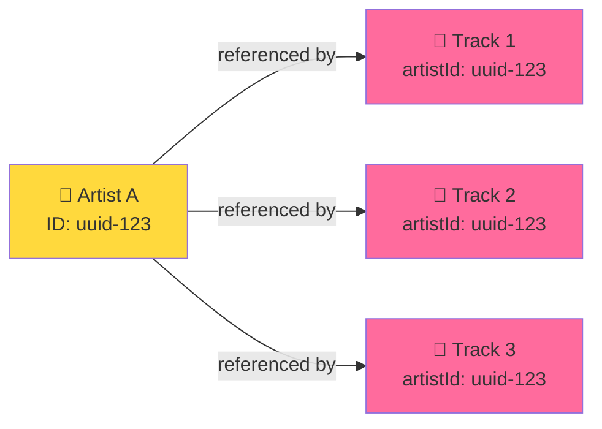
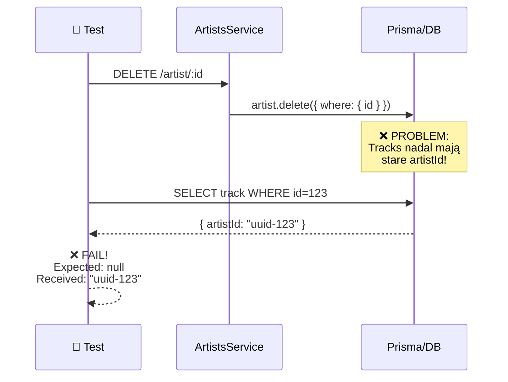

# Problem 3: Cascading Delete - artistId/albumId nie ustawia się na NULL

## Scenariusz Problemu



## Test Failure - Cascade Delete Issue



## Diagnoza: Promise.all vs Transaction

```mermaid
graph TB
    subgraph ❌ "PROBLEM - Promise.all (race condition)"
        P1["await updateMany(tracks)"]
        P2["await updateMany(albums)"]
        P3["await Promise.all(favorites)"]
        P4["await delete(artist)"]
        
        P1 -.->|"Race condition?"| P4
        P2 -.->|"Race condition?"| P4
        P3 -.->|"Race condition?"| P4
        
        style P1 fill:#ff6b6b
        style P2 fill:#ff6b6b
        style P3 fill:#ff6b6b
        style P4 fill:#c92a2a
    end
    
    subgraph ✅ "ROZWIĄZANIE - Transaction"
        T1["transaction(["])
        T2["  updateMany(tracks)"]
        T3["  updateMany(albums)"]
        T4["  delete(favorites)"]
        T5["  delete(artist)"]
        T6["])"]
        
        T1 --> T2
        T2 --> T3
        T3 --> T4
        T4 --> T5
        T5 --> T6
        
        style T1 fill:#51cf66
        style T2 fill:#51cf66
        style T3 fill:#51cf66
        style T4 fill:#51cf66
        style T5 fill:#51cf66
        style T6 fill:#51cf66
    end
```

## Szczegółowe Porównanie

### ❌ PRZED - Promise.all (Race Condition)

```typescript
// artists.service.ts - DELETE artist
async remove(id: string) {
  // ...
  // Mogą być race conditions!
  await this.prisma.track.updateMany({...});     // 1
  await Promise.all([                             // 2
    this.prisma.album.update({...}),
    this.prisma.favorites.update({...}),
  ]);
  await this.prisma.artist.delete({...});         // 3
}
```

**Problem:** Operacje 1,2,3 są asynchroniczne i mogą się nawzajem blokować lub nie wykonać w pełni

### ✅ PO - Transaction (Atomic)

```typescript
// artists.service.ts - DELETE artist
async remove(id: string) {
  // ...
  await this.prisma.$transaction([
    this.prisma.track.updateMany({...}),
    this.prisma.album.updateMany({...}),
    ...artist.favorites.map(fav => 
      this.prisma.favorites.update({...})
    ),
    this.prisma.artist.delete({...}),
  ]);
}
```

**Korzyści:**
- ✅ Atomicity - wszystko albo nic
- ✅ Consistency - DB zawsze w stanie konsystentnym
- ✅ Isolation - bez race conditions
- ✅ Durability - po transakcji, zmiany są trwałe

## Zmienione Serwisy

| Serwis | Metoda | Status | Opis |
|--------|--------|--------|------|
| ArtistsService | `remove()` | ✅ FIXED | Używa $transaction |
| AlbumsService | `remove()` | ✅ FIXED | Używa $transaction |
| TracksService | `remove()` | ✅ FIXED | Uwzględnia favorites |

## Wynik Testu

```
❌ PRZED:
  expect(received).toBeNull()
  Received: "aee1f480-3951-482e-8e37-175851e0e904"
  
✅ PO:
  ✓ should set track.artistId to null after deletion
  ✓ should set album.artistId to null after deletion
  ✓ should set track.albumId = null after delete
```
