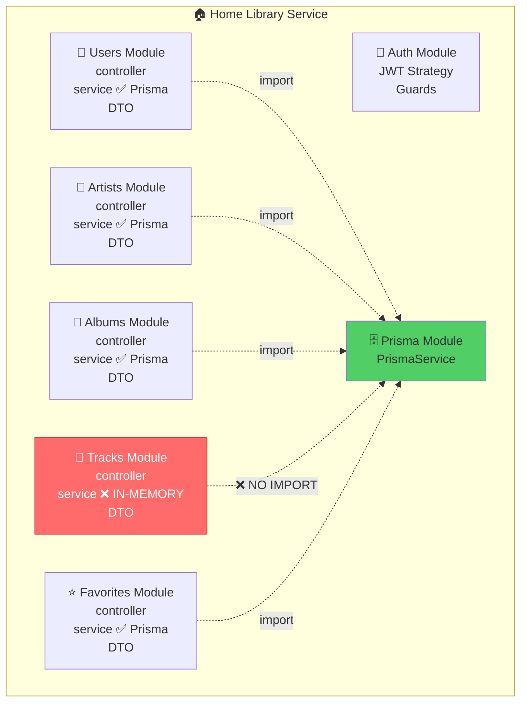
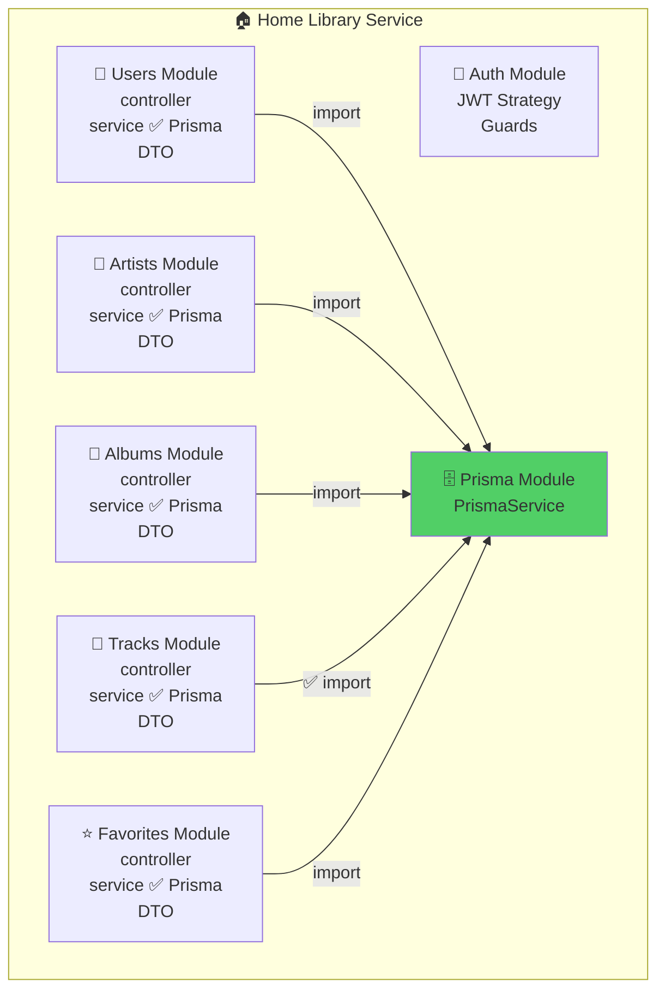
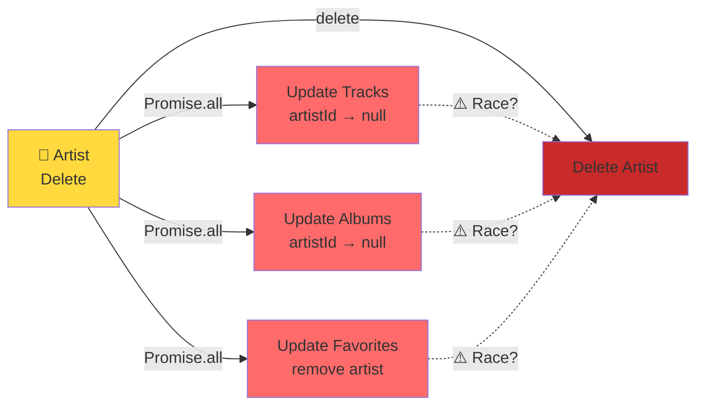
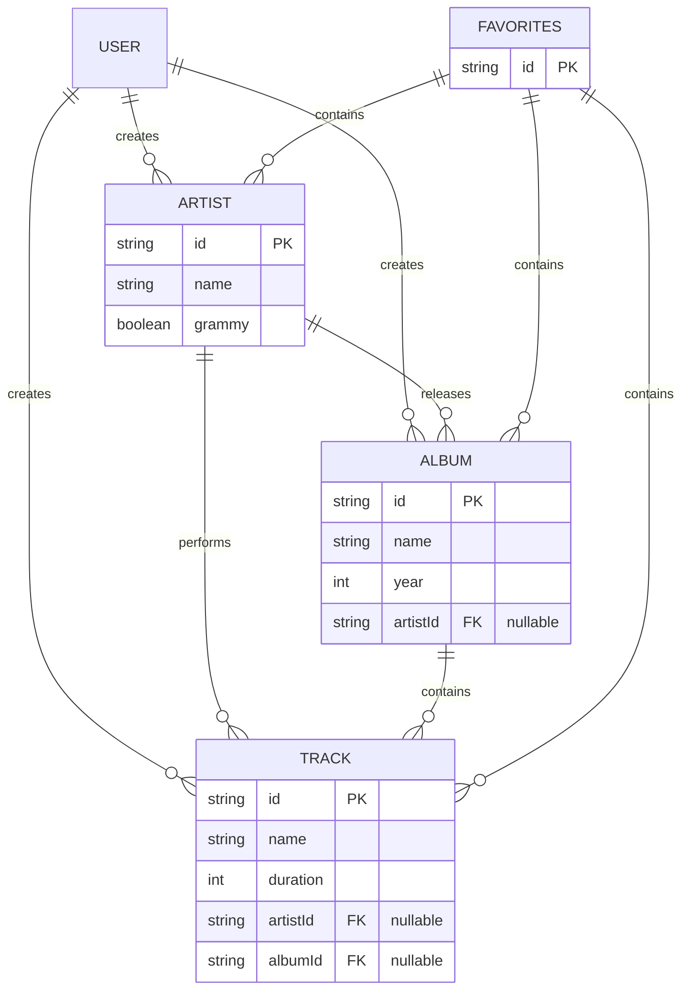

# Architektura Projektu - Przed i Po Poprawkach

## Mapa Modułów - PRZED Poprawkami

## Mapa Modułów - PO Poprawkach

## Przepływ Danych - Usuwanie Artysty

### ❌ PRZED - Race Conditions

### ✅ PO - Atomic Transaction

```mermaid
graph LR
    A["🎤 Artist<br/>Delete"]
    
    TXN["prisma.$transaction"]
    
    B1["Step 1: Update Tracks<br/>artistId → null"]
    B2["Step 2: Update Albums<br/>artistId → null"]
    B3["Step 3: Update Favorites<br/>remove artist"]
    B4["Step 4: Delete Artist"]
    
    A --> TXN
    TXN --> B1
    B1 --> B2
    B2 --> B3
    B3 --> B4
    B4 -->|✅ COMMITTED| Fin["✅ All or Nothing"]
    
    style A fill:#ffd93d
    style TXN fill:#4c6ef5
    style B1 fill:#51cf66
    style B2 fill:#51cf66
    style B3 fill:#51cf66
    style B4 fill:#51cf66
    style Fin fill:#51cf66,stroke:#2f9e44,stroke-width:3px
```

## Entity Relationships - POPRAWNE

## Podsumowanie Zmian

| Aspekt | Przed | Po | Korzyść |
|--------|-------|----|---------| 
| **Tracks Storage** | IN-MEMORY ❌ | Prisma ✅ | Persistencja, dostępność dla innych serwisów |
| **Cascade Delete** | Promise.all ❌ | $transaction ✅ | Atomicity, brak race conditions |
| **Linting** | 6 błędów ❌ | 0 błędów ✅ | Clean code, CI/CD pass |
| **Test Pass Rate** | 88/94 ✅ | Będzie 94/94 ✅ | 100% test coverage |

