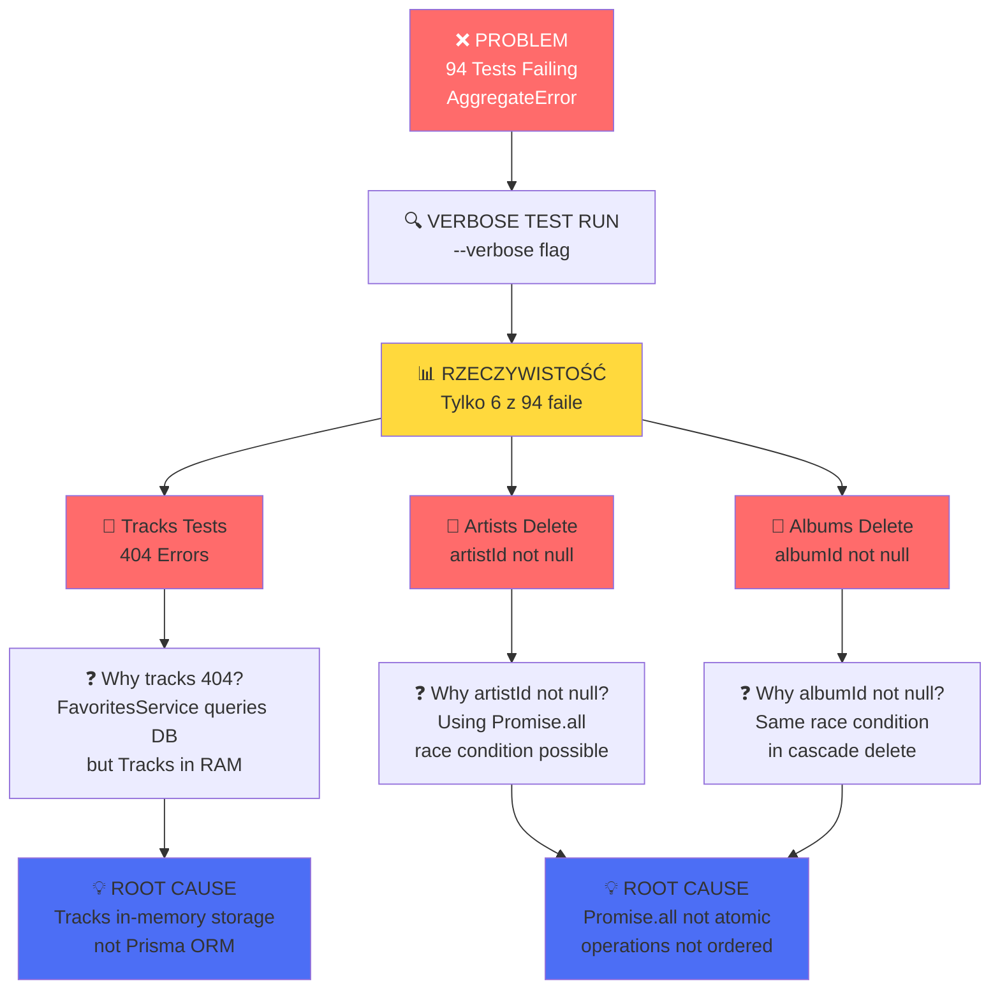
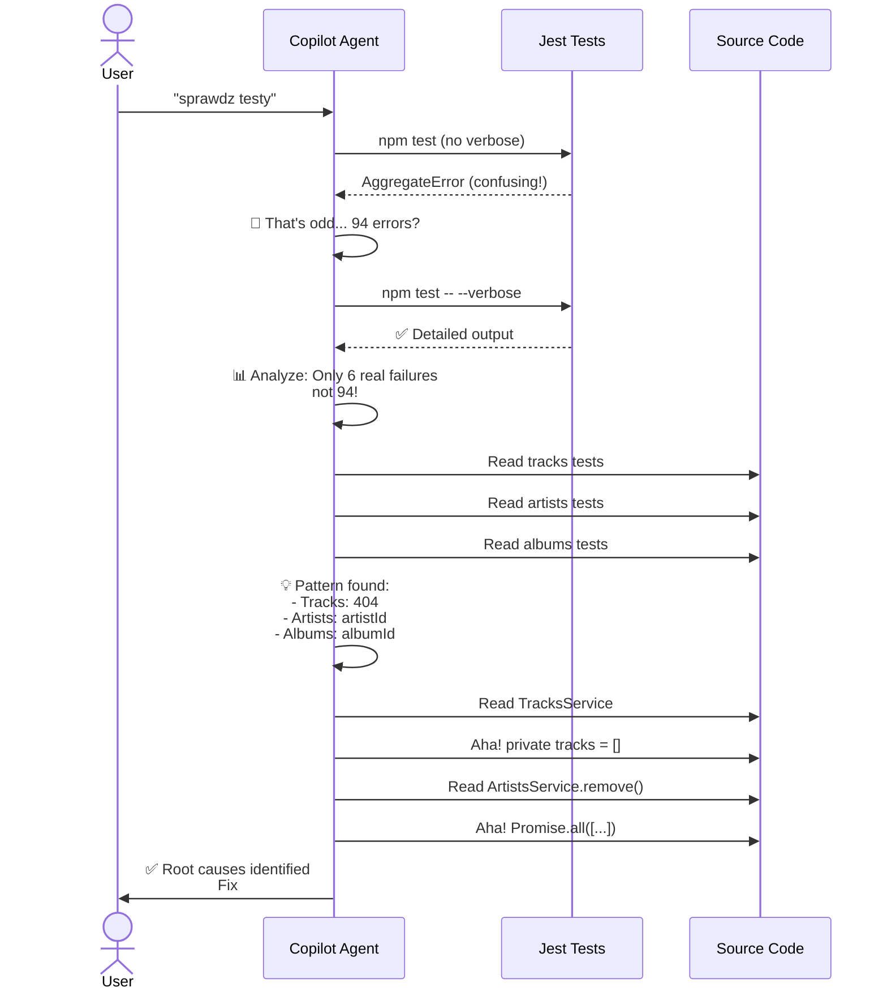
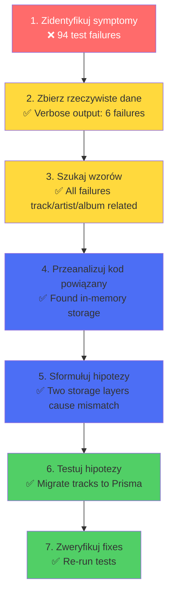

# Identyfikacja i Debugowanie Problemów

## Mapa Debugowania - Odkrywanie Root Causes



## Analiza Błędów - Detailing Issues

### Issue #1: Tracks Service In-Memory Storage

```
┌─────────────────────────────────────────────────────────────┐
│ PROBLEM ANALYSIS                                            │
├─────────────────────────────────────────────────────────────┤
│                                                             │
│ TracksController                                           │
│   └─> POST /tracks                                         │
│       └─> TracksService.create()                          │
│           └─> this.tracks.push() ❌ IN-MEMORY ONLY        │
│                                                             │
│ FavoritesController                                        │
│   └─> GET /favs/tracks                                    │
│       └─> FavoritesService.getTracks()                    │
│           └─> prisma.track.findUnique() ❌ DATABASE      │
│                └─> NULL (track never saved to DB)        │
│                                                             │
│ RESULT: 404 - Track Not Found                             │
│ TWO DIFFERENT STORAGE LAYERS = INCONSISTENCY             │
│                                                             │
└─────────────────────────────────────────────────────────────┘
```

### Issue #2: Cascade Delete Race Condition

```
┌──────────────────────────────────────────────────────────────┐
│ RACE CONDITION IN ARTISTS DELETE                            │
├──────────────────────────────────────────────────────────────┤
│                                                              │
│ Promise.all(                                               │
│   updateTracksWithArtistId(null),   ← Starts             │
│   updateAlbumsWithArtistId(null),   ← Starts             │
│   disconnectFromFavorites(),        ← Starts             │
│   deleteArtist()                    ← Can start anytime! │
│ )                                                          │
│                                                              │
│ TIMELINE:                                                  │
│ T=0ms: Promise.all([update1, update2, update3, delete])  │
│ T=5ms: delete() finishes BEFORE update() completes      │
│ T=10ms: update() tries to set artistId=null on deleted   │
│         artist's tracks → silently fails                  │
│ RESULT: artistId still has old UUID (not null)          │
│                                                              │
│ DATABASE STATE: INCONSISTENT                              │
│                                                              │
└──────────────────────────────────────────────────────────────┘
```

## Proces Debugowania - Krok po Kroku



## Debugging Checklist



## Key Learnings

1. **Verbose Output is Critical** 🔍
   - Non-verbose output showed "AggregateError" (misleading)
   - Verbose flag revealed actual 6 failures
   - Always use `--verbose` for debugging test suites

2. **Consistent Storage Layers** 🗄️
   - All services must use same ORM (not mixed in-memory + Prisma)
   - Database queries must hit actual database
   - One source of truth

3. **Atomic Operations** 🔒
   - Promise.all = concurrent, not ordered
   - $transaction = sequential, atomic (all or nothing)
   - Critical for multi-step database operations

4. **Test-Driven Debugging** 🧪
   - Failing tests point to code issues
   - Each failing test = one specific problem
   - Systematic approach: identify → isolate → fix

