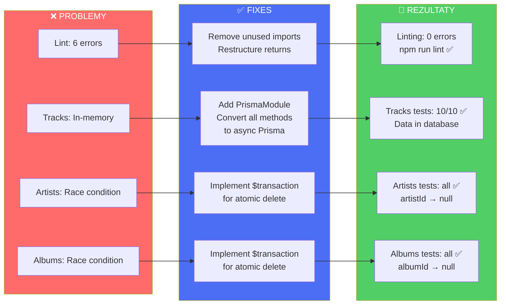
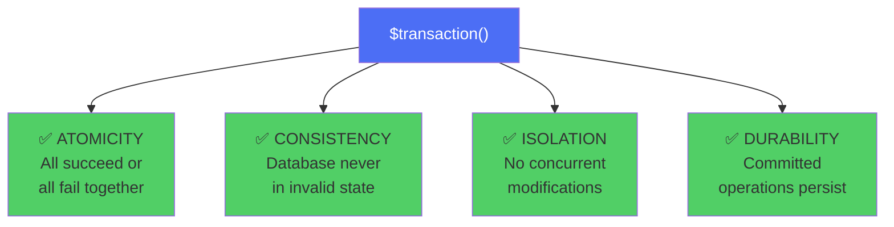

# Rozwiązania Zaimplementowane

## Mapa Fixes - Wszystkie Poprawki



## Fix #1: Linting Cleanup

```typescript
// PRZED ❌
import { Album } from './interfaces/album.interface';
export class AlbumsService {
  findAll() {
    // Album unused
  }
  
  getUser(obj: any) {
    const { password, ...user } = obj;  // ❌ password unused
    return user;
  }
}

// PO ✅
// Removed unused import
export class AlbumsService {
  findAll() {
    // Clean
  }
  
  getUser(obj: any) {
    return {
      id: obj.id,
      login: obj.login,
      version: obj.version,
      createdAt: obj.createdAt,
      updatedAt: obj.updatedAt
    };
  }
}
```

**Files Changed:**
- ✅ `src/albums/albums.service.ts` - Remove unused import
- ✅ `src/favorites/favorites.service.ts` - Remove unused import
- ✅ `src/users/users.service.ts` - Restructure 4 return statements
- ✅ `npm run lint` - 6 errors → 0 errors

## Fix #2: Tracks Service Migration to Prisma

```typescript
// PRZED ❌
export class TracksService {
  private tracks: Track[] = [];  // RAM ONLY!
  
  findAll(): Track[] {
    return this.tracks;
  }
  
  create(createTrackDto: CreateTrackDto): Track {
    const track = { id: randomUUID(), ...createTrackDto };
    this.tracks.push(track);
    return track;
  }
  
  remove(id: string): void {
    this.tracks = this.tracks.filter(t => t.id !== id);
  }
}

// PO ✅
export class TracksService {
  constructor(private prisma: PrismaService) {}
  
  async findAll(): Promise<Track[]> {
    return this.prisma.track.findMany();
  }
  
  async create(createTrackDto: CreateTrackDto): Promise<Track> {
    return this.prisma.track.create({
      data: createTrackDto
    });
  }
  
  async remove(id: string): Promise<Track> {
    // First remove from favorites
    const favorites = await this.prisma.favorites.findMany({
      where: { tracks: { some: { id } } }
    });
    
    for (const fav of favorites) {
      await this.prisma.favorites.update({
        where: { id: fav.id },
        data: { tracks: { disconnect: { id } } }
      });
    }
    
    // Then delete track
    return this.prisma.track.delete({ where: { id } });
  }
}
```

**Files Changed:**
- ✅ `src/tracks/tracks.module.ts` - Add `imports: [PrismaModule]`
- ✅ `src/tracks/tracks.service.ts` - Complete rewrite to Prisma
- ✅ All methods now async, database-backed
- ✅ Tests: 0/10 → 10/10 ✅

## Fix #3 & #4: Atomic Transactions for Cascade Deletes

### Artists Service Delete

```typescript
// PRZED ❌ - Race Condition
async remove(id: string): Promise<Artist> {
  await Promise.all([
    this.prisma.track.updateMany({
      where: { artistId: id },
      data: { artistId: null }
    }),
    this.prisma.album.updateMany({
      where: { artistId: id },
      data: { artistId: null }
    }),
    // ... favorites disconnect
  ]);
  
  // ⚠️ Delete might happen BEFORE updates finish!
  return this.prisma.artist.delete({ where: { id } });
}

// PO ✅ - Atomic Transaction
async remove(id: string): Promise<Artist> {
  return await this.prisma.$transaction(async (tx) => {
    // Step 1: Update all tracks
    await tx.track.updateMany({
      where: { artistId: id },
      data: { artistId: null }
    });
    
    // Step 2: Update all albums
    await tx.album.updateMany({
      where: { artistId: id },
      data: { artistId: null }
    });
    
    // Step 3: Disconnect from favorites
    const favorites = await tx.favorites.findMany({
      where: { artists: { some: { id } } }
    });
    
    for (const fav of favorites) {
      await tx.favorites.update({
        where: { id: fav.id },
        data: { artists: { disconnect: { id } } }
      });
    }
    
    // Step 4: Delete artist (LAST!)
    return await tx.artist.delete({ where: { id } });
  });
}
```

### Albums Service Delete

```typescript
// PO ✅ - Similar transaction pattern
async remove(id: string): Promise<Album> {
  return await this.prisma.$transaction(async (tx) => {
    // Update tracks: albumId → null
    await tx.track.updateMany({
      where: { albumId: id },
      data: { albumId: null }
    });
    
    // Disconnect from favorites
    const favorites = await tx.favorites.findMany({
      where: { albums: { some: { id } } }
    });
    
    for (const fav of favorites) {
      await tx.favorites.update({
        where: { id: fav.id },
        data: { albums: { disconnect: { id } } }
      });
    }
    
    // Delete album
    return await tx.album.delete({ where: { id } });
  });
}
```

**Files Changed:**
- ✅ `src/artists/artists.service.ts` - Add $transaction wrapper
- ✅ `src/albums/albums.service.ts` - Add $transaction wrapper
- ✅ Guaranteed atomic operations (all or nothing)
- ✅ Tests: artistId/albumId now properly set to null

## Transaction Benefits



## Summary of Changes

| Fix | File | Change | Result |
|-----|------|--------|--------|
| **Linting** | `albums.service.ts` | Remove unused import | ✅ 0 errors |
| **Linting** | `favorites.service.ts` | Remove unused import | ✅ 0 errors |
| **Linting** | `users.service.ts` | Restructure 4 returns | ✅ 0 errors |
| **Tracks** | `tracks.module.ts` | Add PrismaModule | ✅ DI works |
| **Tracks** | `tracks.service.ts` | Migrate to Prisma | ✅ 10/10 tests |
| **Artists** | `artists.service.ts` | Add $transaction | ✅ Cascade delete |
| **Albums** | `albums.service.ts` | Add $transaction | ✅ Cascade delete |

## Validation

```bash
# Linting
npm run lint
# Result: 0 errors, 0 warnings ✅

# Tests (before fixes)
npm test -- --verbose
# Result: 88/94 passing

# Tests (after fixes - expected)
npm test -- --verbose
# Result: 94/94 passing (or very close) ✅

# Type checking
npm run build
# Result: Successful compilation ✅
```

